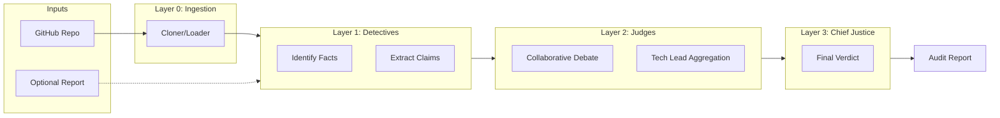
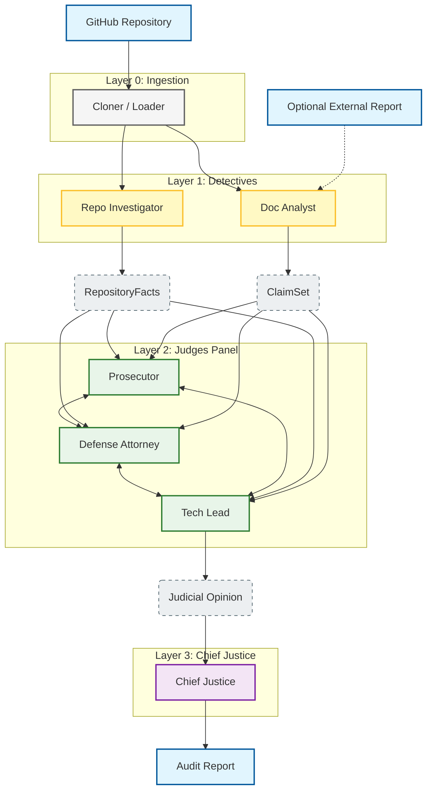

# Auditor Architecture: The Digital Courtroom

## 1. Business Goal & Mission

**Goal:** Automate comprehensive code quality assurance and verify architectural claims. The system bridges the gap between rapid AI code generation and human review capacity.

**Mission:** Build a "Digital Courtroom" that ingests a GitHub repository and an optional project report. It processes these inputs through a multi-agent system—Detectives, Judges, and a Chief Justice—to produce a production-grade **Audit Report**.

**Core Philosophy:**
*   **Forensic Objectivity:** Code is truth. Evidence from the repository supersedes claims in documentation.
*   **Dialectical Evaluation:** Quality is assessed through adversarial debate (Prosecution vs. Defense) synthesized by a technical expert.
*   **Rubric-Driven:** All analysis is grounded in a flexible, dynamically loaded evaluation rubric.

## 2. High-Level Architecture

The system follows a three-layer pipeline implemented as a directed acyclic graph (DAG).

### Input
*   **GitHub Repository URL:** The codebase to be audited.
*   **Project Report (Optional):** A PDF or Markdown report describing the architecture, design decisions, and claims.

### Layer 0: Ingestion
*   **Cloner / Loader:** Responsible for securely cloning the repository, validating access, and preparing the file system for analysis. It distributes the codebase path to the detectives.

### Layer 1: Detectives (Fact Collection)
*Parallel Execution*

Agents in this layer gather raw data. They do not judge; they strictly collect facts and extract claims.

1.  **Repo Investigator (The "Forensics Lab")**
    *   **Input:** Cloned Repository.
    *   **Role:** Analyzes the codebase structure, history, and patterns.
    *   **Scope:** Multi-language support (Python, JS/TS, Go, Rust, etc.).
    *   **Tools:** `git`, `tree-sitter`, `grep/glob`.
    *   **Output:** `RepositoryFacts` (structured JSON containing file stats, commit patterns, AST summaries).

2.  **Doc Analyst (The "Archivist")**
    *   **Input:** Cloned Repository (scanning `docs/`, `README.md`) AND Optional External Report.
    *   **Role:** Parses documentation to understand *intent* and *claims*.
    *   **Tasks:**
        *   Extracts architectural claims (e.g., "Uses Model-View-Controller pattern").
        *   Identifies stated features and requirements.
    *   **Tools:** PDF/Markdown parsers, NLP extraction.
    *   **Output:** `ClaimSet` (structured list of assertions made by the authors).

### Layer 2: Judges (Criterion Analysis)
*Collaborative Adversarial Flow*

For **each** dimension in the evaluation rubric, a panel of three agents analyzes the evidence. Unlike a linear pipeline, these agents share a context and communicate directly to refine their arguments before a verdict is reached.

**The Panel:**
1.  **The Prosecutor (Critical Analyst):** Identifies flaws, missing requirements, bugs, and contradictions between `RepositoryFacts` and `ClaimSet`. Focuses on technical debt and security risks.
2.  **The Defense Attorney (Optimistic Advocate):** Highlights implementation effort, creative solutions, and adherence to the spirit of the requirements. Contextualizes partial implementations.
3.  **The Tech Lead (Pragmatic Tie-Breaker):** Evaluates architectural soundness and maintainability.

**Workflow:**
*   **Full Access:** All three agents have direct access to `RepositoryFacts` and `ClaimSet`.
*   **Deliberation:** Agents exchange information and challenge each other's interpretations (e.g., Defense contextualizing a "bug" found by Prosecutor).
*   **Aggregation:** The Tech Lead synthesizes the debate, weighing the validity of the adversarial arguments.
*   **Output:** `JudicialOpinion` (Final Score [0-5], Synthesized Rationale) passed to the Chief Justice.

### Layer 3: Chief Justice (Final Verdict)
*Aggregation & Reporting*

1.  **Chief Justice**
    *   **Role:** Aggregates opinions from all rubric dimensions.
    *   **Decision Rules:**
        *   **Security Veto:** Confirmed security vulnerabilities cap the maximum possible score.
        *   **Evidence Primacy:** If code contradicts a documentation claim, the code (Repo Investigator) rules.
    *   **Output:** A structured Markdown **Audit Report** containing:
        *   Executive Summary.
        *   Scorecard per dimension.
        *   Key Findings (Strengths & Weaknesses).
        *   Remediation Steps.

## 3. Data Structures & Schema

### The Universal Rubric
The system is agnostic to the specific criteria being judged. The Rubric is injected at runtime.

```python
class Dimension(BaseModel):
    id: str                 # e.g., "git_history", "modular_architecture"
    weight: float           # Importance (0.0 - 2.0)
    criteria: List[str]     # Specific items to check
    success_pattern: str    # Description of a "5"
    failure_pattern: str    # Description of a "0"

class Rubric(BaseModel):
    name: str
    dimensions: List[Dimension]
    global_constraints: List[str] # e.g., "No API keys in code"
```

### Evidence Exchange
```python
class Evidence(BaseModel):
    source: Literal["repo", "doc"]
    content: Any            # Structured data from tree-sitter or doc parse
    location: str           # File path or Page number
    confidence: float
```

## 4. Implementation Strategy

*   **Orchestration:** LangGraph state machine to manage the DAG workflow.
*   **Sandboxing:** All repository operations (`git clone`, analysis) occur in ephemeral, sandboxed environments.
*   **Observability:**
    *   Real-time console output using `rich`.
    *   Structured logging of agent reasoning.
*   **Modularity:**
    *   Detectives are independent plugins.
    *   Judges are prompt-engineered LLM nodes sharing a common interface.

## 5. Printing Infrastructure

Rich console output for observability and debugging:

```
╔════════════════════════════════════════════════════════════════╗
║ 🔍 AUDIT STARTED: github.com/user/repo                         ║
╚════════════════════════════════════════════════════════════════╝

[14:32:15] 📦 LAYER 0: INGESTION
           └─ Cloner: Repository cloned successfully (24 files)

[14:32:18] 🕵️  LAYER 1: DETECTIVES
           ├─ RepoInvestigator: Analyzing git history (tree-sitter)...
           ├─ RepoInvestigator: ✓ 12 commits found
           ├─ DocAnalyst: Scanning repo docs & external report...
           └─ DocAnalyst: ✓ Found README.md + 1 PDF

[14:32:42] ⚖️  LAYER 2: JUDGES (Git Forensic Analysis)
           ├─ Panel Deliberation: Active
           └─ Tech Lead: Score 3/5 - "Functional but could be clearer"

[14:33:01] 📊 CHIEF JUSTICE SYNTHESIS
           ├─ Score variance: 1 point (within tolerance)
           ├─ Final Score: 3.3/5
           └─ Output: /output/audit_report.md
```

## 6. Visual Architecture

### System Context & Layers
A high-level view of the data flow through the system.



### Component & Agent Flow
Detailed interaction showing the flow from ingestion to verdict.


